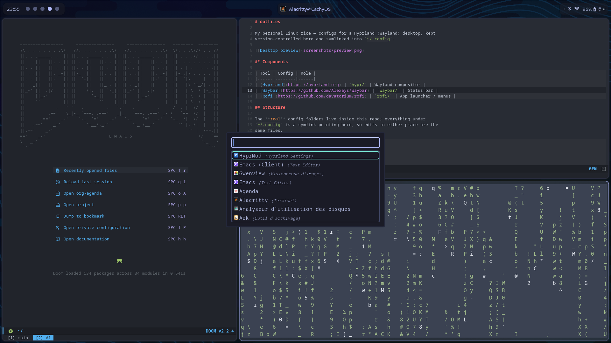

# dotfiles

My personal Linux rice — configs for a Hyprland (Wayland) desktop, kept
version-controlled here and symlinked into `~/.config`.



## Components

| Tool | Config | Role |
|------|--------|------|
| [Hyprland](https://hyprland.org) | `hypr/` | Wayland compositor |
| [Waybar](https://github.com/Alexays/Waybar) | `waybar/` | Status bar |
| [Rofi](https://github.com/davatorium/rofi) | `rofi/` | App launcher / menus |

## Structure

The **real** config folders live inside this repo; everything under
`~/.config` is a symlink pointing here, so edits in either place are the
same files.

```
~/dotfiles
├── hypr/          → ~/.config/hypr
├── waybar/        → ~/.config/waybar
├── rofi/          → ~/.config/rofi
└── screenshots/   → preview images for this README
```

## Setup on a new machine

```bash
ln -s ~/dotfiles/hypr   ~/.config/hypr
ln -s ~/dotfiles/waybar ~/.config/waybar
ln -s ~/dotfiles/rofi   ~/.config/rofi
```

> Alternative: `cd ~/dotfiles && stow hypr waybar rofi` (GNU Stow does the
> same symlinking automatically).

## Screenshots

Captured with `grim` + `slurp`, stored in `screenshots/` so GitHub renders
them in this README.
